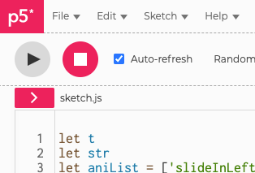
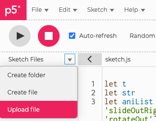

# p5-animated-text

A library that adds text animation to the p5.js

Want to see all the animations? https://scarysheep.github.io/p5-creative-coding/projects/animatedText/index.html

Want to see a basic demo of usage? https://editor.p5js.org/ScarySheep/sketches/5CpIcQxcK

Current animations. More to come!

- slideInLeft
- slideInRight
- slideInUp
- slideInDown
- slideOutLeft
- slideOutRight
- slideOutUp
- slideOutDown
- zoomIn
- zoomOut
- rotateIn
- rotateOut

# How to use it?

First, initialize the object somewhere

```javascript
let t = new AnimatedText(string, x1, y1, color, animationType, [length], [autostart])
```

- string: the word that you want to show, in a string format like "hello there"
- x1, y1: the bottom left position of the text
- color: the color of the text, must be a p5 color object such as color(0), color('#ff0000') etc.
- animationType: the type of animation you want to use, also in a string format like "slideInLeft", you can see the full list on the top of the page
- length: (optional parameter), the total time of the animation, default is 1000(millisecond)
- autostart: (optional parameter), by default the animation will start the moment you initialize the object, enter false if you don't want to

Then put this line in the p5 draw function whenever you want to draw it

```javascript
t.render()
```

Whenever you want to start the animation again call. Remember don't put this in a loop unintentionally or it will keep restarting.

```javascript
t.start()
```

Change the text

```javascript
t.setText("Your new text!")
```

Change the animation

```javascript
t.setAnimation("enter the animation name here")
```

Change the position

```javascript
t.setPosition(x1,y1)
```

Change the color

```javascript
t.setColor(color)
```


# Important stuff

This library is built to be compatible with p5 as much as possible. So normally all functions like textSize(), rotate(), scale(), etc will affect the animation text except fill() since we are passing the color manually.

**Remember to use fill() again if you want to draw anything after drawing the animation!**

At this moment the animation text doesn't support the x2, y2 parameters that you can find in the p5 library text function.

The library also doesn't really work with multiline text since it can't detect the total height of it.

# How to add it to your project?

### Own project

Download the animatedText.js file and put it in your desire folder.

Link the animatedText.js file **after** the p5.js script tags

```html
<!--p5.js-->
<script src="https://cdnjs.cloudflare.com/ajax/libs/p5.js/1.4.0/p5.js"></script>
<script src="https://cdnjs.cloudflare.com/ajax/libs/p5.js/1.4.0/addons/p5.sound.min.js"></script>
<!--enter this line-->
<script src="location of the animatedText.js file"></script>
```

### p5 editor

Download the animatedText.js file. Open up your p5 editor project. Click the arrow next to sketch.js



Click the down arrow and upload the animatedText.js file



Go to the index.html file and enter the script tag of the animatedText.js file after the p5.js tags

```html
<script src="https://cdnjs.cloudflare.com/ajax/libs/p5.js/1.4.0/p5.js"></script>
<script src="https://cdnjs.cloudflare.com/ajax/libs/p5.js/1.4.0/addons/p5.sound.min.js"></script>
<!--enter this line-->
<script src="animatedText.js"></script>
```

